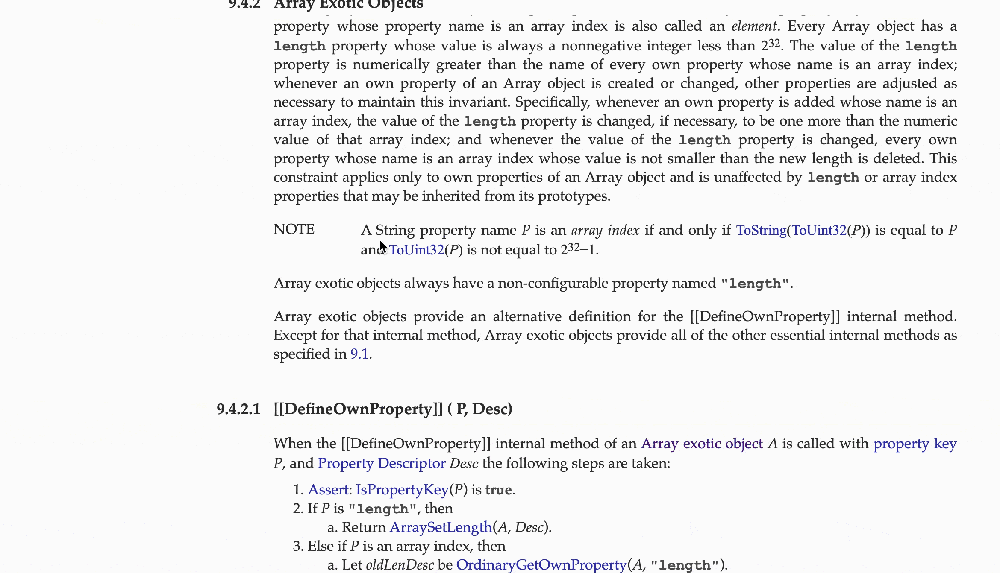
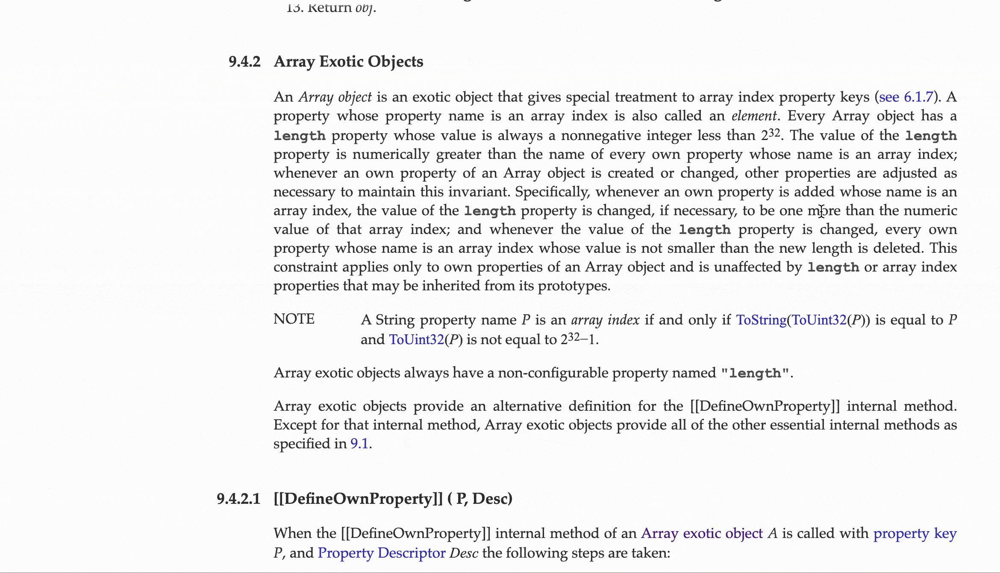

*技术类文档语法一般会尽量简单，但是难免碰到很多不熟悉或根本不认识的单词，切出去找翻译又嫌麻烦，正好，这里有一款浏览器插件可以帮你快速地提供释义，让你读文档纵享丝滑*

**单词翻译：**

**整句翻译(图片过大减帧，实际上翻译速度和单词一样)：**

# Doc-assistant
 + 仓库地址： [github](https://github.com/DarthVaderrr/doc-assistant)
 + 浏览器环境下的英文文档阅读辅助插件
 + 支持单词快速翻译，整句翻译，特殊词汇百科词条链接
 + 可以去扩展程序商店搜索doc-assistant并免费安装 :
 + 火狐:[火狐浏览器安装地址](https://addons.mozilla.org/zh-CN/firefox/addon/doc-assistant/?src=search)  
 + chrome:[谷歌浏览器安装地址](https://chrome.google.com/webstore/detail/doc-assistant/llofohehnjedogahngiiaifnfncfbona/related?hl=zh-CN&gl=RU)
 + 这款插件本是为我自己量身定做的，但是考虑到可能有很多和我情况类似的同学也许用得上，所以安排了上架和开源。想直接用可以到浏览器商店安装，如果想按自己的需求修改插件功能可以看下面的步骤：

## 本地加载方式
 + git clone https://github.com/DarthVaderrr/doc-assistant.git
 + npm install
 + 打开src/open-api/index.js 做如下修改：
    - import baidu from './baidu.js' 改成 import baidu from './baidu-pub.js'
    - import baidu from './yeekit.js' 改成 import baidu from './yeekit-pub.js'
    - import baidu from './youdao.js' 改成 import baidu from './youdao-pub.js'
 + 申请 [有道智云](https://ai.youdao.com/index.s) api账号  将获得的appid和密码填入 youdao-pub.js的api字段内
 + npm run build
 + 谷歌浏览器  
   1. 依次点击三个点->更多工具->扩展程序
   2. 打开右上角开发者模式
   3. 加载已解压的扩展程序
   4. 选择manifest.json所在的目录 resources/  添加成功后 插件即可生效
   5. 点击右上角进入偏好设置
 + 火狐浏览器  
   1. 地址栏输入 about:debugging
   2. 左侧边栏->此firefox
   3. 临时载入附加组件
   4. 选择manifest.json文件  即可生效
# 调试和修改
 1. app样式修改: resources/app/front-dom/dom.less
 2. 默认翻译接口修改：resources/src/js/utils/init_settings.js
 3. app行为调整：resources/app/content_script/
 4. npm run build
 5. 回到添加插件的地方  点击重载按钮
 6. 调试前请自行准备好api接口所需的appid和key 
 7. 已经写好了有道 百度 和译云的接口调用模块  只需要自己申请账号填入即可
 
## 翻译接口说明 如何申请api
|接口名称|申请地址|调用限制|备注|
|:-|:-:|-:|-:|
|有道|[有道智云](https://ai.youdao.com/index.s)|按字计费,注册送一百元体验金|仅支持jsonp|
|百度|[百度翻译](https://api.fanyi.baidu.com/api/trans/product/index)|每月送两百万字,每秒限十字|仅支持jsonp|
|译云|[译云](http://api.yeekit.com/mannual.php)|免费,每小时1000积分,扣完暂停一小时|支持ajax|

# 目录结构
 + node_modules  
 + resources  
  + manifest.json  ------插件描述文件  
  + app  
    - background  -------后台页面
       -  background.html  
       -  background.js  
       -  background.css  
    - content_script 
       -  app-action.js ------定义app的页面行为  
       -  extension-action.js  ------定义app的初始化,通信等行为  
       -  index.js ------content_script入口  
    - front-dom  
       -  dom.js  ------仅用于导入app样式,不含任何业务逻辑
       -  dom.less ------用于放置app的样式
    - option ------选项设置页
       - option.html  
       - option.js  
       - option.css
    - popup ------点击右上角图标弹出的小窗口
       - popup.html  ------option页面的入口在这里
       - popup.js  
       - popup.css
  + dist ------打包结果存放目录
    - content_script.js ------content_script打包结果  
       - dom.css  ------dom.less打包结果  
       - option.js ------option打包结果  
       - popup.js ------popup打包结果 
  + src  ------ 存放js和图片资源
    - css 
       - layout.css ------基础通用布局样式  
    - img  -------用到的图标  
    - js -------主要业务逻辑代码  
       - extension-api  -------兼容chrome和firefox的extension_api封装  
         - index.js  ------api出口  
         - storage.js  --------本地存储api封装
      - open-api -------翻译接口api封装  
         - index.js  -------api出口  
         - youdao.js    -------有道翻译api封装  
      - translateCallback   ------- 翻译接口的回调函数
         - youdao.js   -------有道词典接口的回调函数  
         - index.js --------回调函数出口
      - utils  ------- 一些用到的项目js模块
         - createCssBySetting.js  -------将偏好设置json映射成css  
         - function-extend.js    ------- 节流与防抖函数  
         - http.js   -------- 发送请求的函数  
         - init_setting.js    --------存放默认设置的对象  
         - jsonp.js    ------- 封装的jsonp函数    
         - sha256.js   ------- 调翻译接口需要的哈希算法
         - init_settings.js  -------app的默认配置,样式 翻译接口选择等配置
 + package.lock.json
 + package.json
 + postcss.config.js
 + readme.md
 + webpack.config.js

## TODO
- [ ] 跨浏览器  目前仅在谷歌 火狐测试过
- [ ] 稳定免费接口 
- [x] 支持用户偏好设置 : 颜色  位置  大小  显示内容   
- [ ] 实现对浏览器dom以外的支持  包括dev-tool 标题栏  剪切板等  
- [ ] css-normalize  某些样式会被页面的样式覆盖  
- [x] 乱码问题  